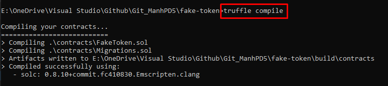
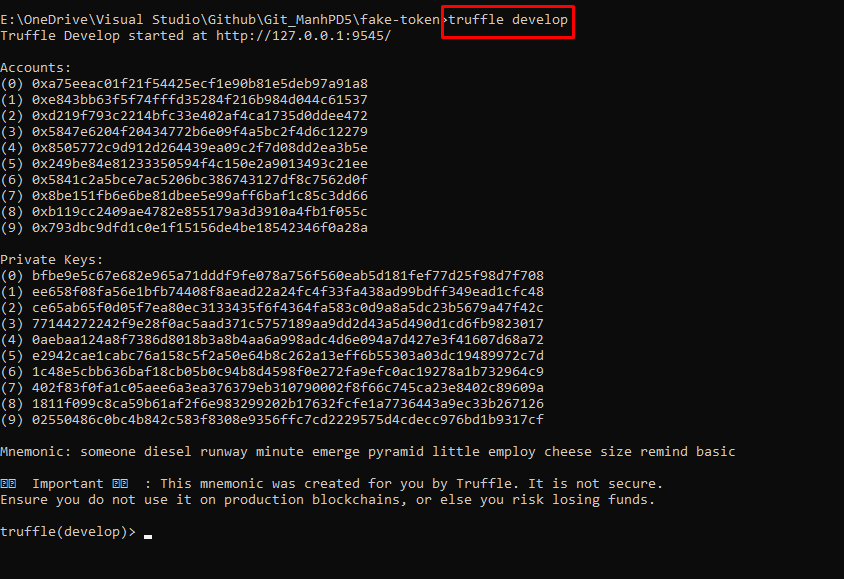
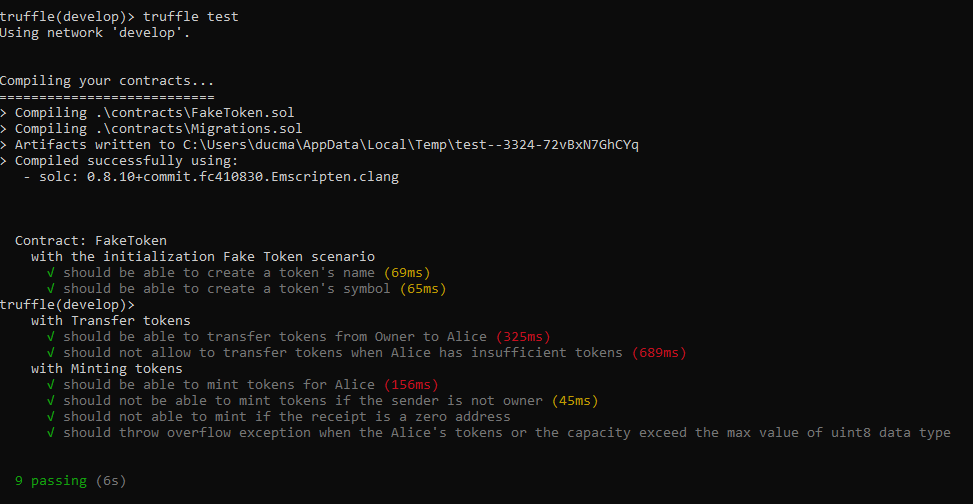

<br>

## Table of Contents
- [Given problem](#given-problem)
- [Solution for this problem](#solution-for-this-problem)
- [The structure of current project](#the-structure-of-current-project)
- [How to run and test the current project](#how-to-run-and-test-the-current-project)
- [Benefits and Drawbacks](#benefits-and-drawbacks)
- [Wrapping up](#wrapping-up)


<br>

## Given problem

Create a smart contract in Ethereum using Solidity or Vyper or an application in Ethereum that:
1. Mint & Transfer tokens.
2. Set a token hard cap.

Other functions that you may wish to program, it will go into the hiring consideration and the codes should be able to run on Truffle or Remix for our consideration.


<br>

## Solution for this problem

In the [Given problem](#given-problem) section, we can see that our problem is to create a smart contract that contains three methods:
1. Mint tokens for a specific account.

2. Transfer tokens from an account to another account.

3. Set the total supply of our tokens.

Before going into implement these methods, we need to clear about these concepts.
- Mint tokens for a specific account.

    Minting means that adding the number of token to our total supply, and add it to a specific account.

    So, below is some things that we need to take care in this method:
    - Only a smart contract's owner has permission to mint.
    - These tokens can not be send to zero address. This action is not minting, it is the burning tokens.
    - Check overflow value for a data type's range value.

- Transfer tokens from an account to another account.

    Below is some things that we need to take care in this method:
    - The sender account should have sufficient tokens to transfer.

- Set the total supply of our tokens.

    In this case, we will use constructor of our smart contract to set the total supply.


<br>

## The structure of current project

Below is the structure of this project when we use `truffle init` command to initialize.

```bash
> tree

├── README.md
├── contracts
│   └── Migrations.sol
├── migrations
│   └── 1_initial_migration.js
├── test
└── truffle-config.js
```

The `contracts` directory will be used to code our **FakeToken** smart contract.

The `migrations` directory will be used to deploy our **FakeToken** smart contract.

The `test` directory, obviously, is a place we can write our test cases.

To configure the information of blockchain that we want to use, for example, local blockchain of ganache, test net of Ethereum, we can fill into the `truffle-config.js` file.


<br>

## How to run and test the current project

0. Go to our project's directory.

1. Build our source code.

    ```bash
    truffle compile
    ```

    

2. Run our local truffle server tha follow on `truffle-config.js` file.

    ```bash
    truffle develop
    ```

    

3. To run test, run the below command:

    ```bash
    truffle test
    ```

    


<br>

## Benefits and Drawbacks

1. Benefits

    - straightforward to work.

2. Drawbacks

    - This smart contract is not following the ERC-20 token of Ethereum blockchain.

        Using OpenZeppline to implement its IERC20 interface.

    - Security in blockchain is really an important part. So this project can lack that, epsecially mathematical issues.

        To improve it, we can use OpenZeppline. Then, can use SafeMath class.


<br>

## Wrapping up


<br>

[I Went From No Coding Experience To Creating An Ethereum Application Within One Year](https://hackernoon.com/i-went-from-no-coding-experience-to-creating-an-ethereum-application-within-one-year-k03y35m5)

[Writing Tests in Solidity](https://trufflesuite.com/docs/truffle/testing/writing-tests-in-solidity.html)

[INTRODUCTION TO THE ETHEREUM STACK](https://ethereum.org/en/developers/docs/ethereum-stack/)